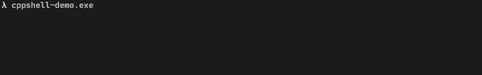

# cppcmd
[](https://travis-ci.com/remysalim/cppcmd)

A lightweight and simple C++ command interpreter for your command interpreting needs.

<!-- TOC -->

- [Quick start](#quick-start)
  - [Minimal working sample](#minimal-working-sample)
  - [Parsing arguments](#parsing-arguments)
- [Exceptions](#exceptions)
- [Overriding defaults](#overriding-defaults)
  - [Defining a custom 'Expression'](#defining-a-custom-expression)
  - [Setting the line-end character](#setting-the-line-end-character)
  - [Changing prompt string](#changing-prompt-string)
  - [More](#more)
- [Building and running tests](#building-and-running-tests)
- [Contributing](#contributing)

<!-- /TOC -->

## Quick start

### Minimal working sample

``` cpp
#include <iostream>
#include <cppcmd/CommandInterpreter.hpp>

using namespace cppcmd;
int main() {
    auto cli = CommandInterpreter(
        std::cin,  // input stream
        std::cout, // output stream
        std::cout  // prompt stream (optional)
    );

    cli.registerCommand("foo", [](const auto& args, auto& os) {
        os << "Hello from foo!\n";
        if (args.size()) {
            os << "got args: ";
            for (const auto& arg : args) os << arg << ' ';
            os << '\n';
        }
    });

    cli.run();
}
```

<p align="center">
  
</p>

### Parsing arguments

Arguments can be easily parsed from a string using `cppcmd::as<T>` in a command callback.

``` cpp
int value = 0;
cli.registerCommand("foo", [](const auto& args, auto& os) {
    value = as<int>(args[0]);

    // below is valid if Args == cppcmd::values::ValueString (default)
    value = args[0].as<int>();
});
```

## Exceptions

Unexpected parsing errors yield `cppcmd::parse_error` exceptions, that extends `std::exception` .

_i.e_:

``` cpp
// bool regex mismatch throws
as<bool>("foobar");

// out of bound throws
as<uint8_t>("0xffff");

// trying to hold a signed value into an unsigned type throws
as<unsigned int>("-1");

// invalid string conversion throws
as<float>("number");
```

## Overriding defaults

Default is described as follows:

* A `Command` is a `std::string` 
* `Args` are stored in a `std::vector` of `cppcmd::values::ValueString` 
* `Callback` signature is a `std::function<void(Args, OutputStream&)>` 

### Defining a custom 'Expression'

An `Expression` defines the type of a `Command` , the separator character in between arguments, and the container in which the arguments are contained.

_i.e_:

``` cpp
using DefaultExpression = Expression<string, vector<values::ValueString>, ' '>;
```

Note:  
`values::ValueString` is merely a `std::string` wrapper that implicitly converts to and from `std::string` and exposes `values::ValueString::at<T>()` to facilitate value parsing.

### Setting the line-end character

Line-end is specialized along with `Expression` definition:

``` cpp
auto cli = CommandLine<DefaultExpression, '\n'>(is, os, tty);
```

### Changing prompt string

You can override the default `>>>` _prompt string_ (equivalent to PS1 under bash) as needed.

``` cpp
auto cli = CommandLine(is, os, tty, "$ ");

// if no prompt is expected, omit the prompt stream parameter
auto cli = CommandLine(is, os);
```

### More

Additional samples and usage can be found in tests sources and in `cppcmd-demo` app:

* See [apps/main.cpp](apps/main.cpp)
* See [tests/test_main.cpp](tests/test_main.cpp)

## Building and running tests

``` bash
$ mkdir build && cd build

# test dependencies are resolved using Conan
$ conan install ..

$ cmake ..
$ cmake --build . --target cppcmd-test
$ ctest
```

## Contributing

* Issues and bugs can be raised on the [Issue tracker on GitHub](https://github.com/remysalim/cppcmd/issues)
* Pull requests are welcomed!

TO DO:

* Handle arrow keys, del, backspace input
* Add history
* Allow specialization of callback signature
